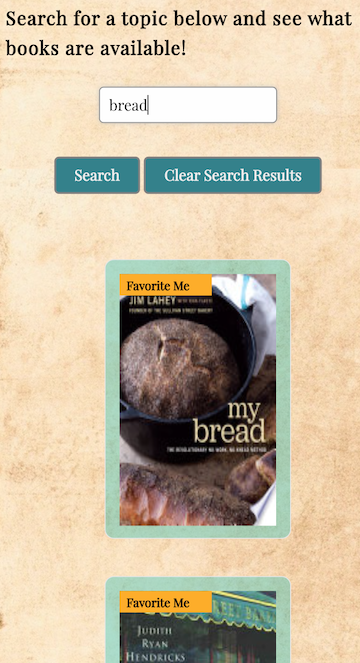

# Book Search

* [Introduction](#Introduction)
* [Summary](#Summary)
* [Demo](#Demo)
* [Functionality](#Functionality)
* [User Stories](#UserStories)

## Team Members:
* [Andrew Ungvary](https://github.com/aungy5)
* [Jeff Mullen](https://github.com/jeffMullen)
* [Alina Zaidi](https://github.com/az84)

***
## Introduction:

For our book search project, we decided to create a site that utilizes the Google Books API and the NYT Books API to bring the user a wide variety of books they can read based on their input. The user is able to search for topics and have a list of books about that topic dynamically generated on the page. After the results are generated, the user can click on the various books to learn more about them, as on click they will be redirected to a google books page with further information on the selected book. The user is also able to select a NYT best seller list to view, and it will be dynamically generated in the best seller list section. 

**Link to our website:** [Star Books](https://az84.github.io/Project-1/)

***
## Summary:

In this project we were asked to create a website that meets the acceptance criteria below:

- Use at least two server-side APIs

- Must use a CSS framework other than Bootstrap

- Must use client-side storage to store persistent data

- Polished UI

- Good quality coding standards

- No alerts, confirms, or prompts (use modals)

- Deployed on GitHub Pages

- Must be interactive (accept and respond to user input)

***
## APIs Used:

New York Times Books API --> https://developer.nytimes.com/docs/books-product/1/overview

Google Books API --> https://developers.google.com/books/docs/v1/using

## CSS Framework Used:

 Zurb (link below)

https://get.foundation/sites/docs/

***

## Functionality: 

- Searching for a topic returns results from Google Books API

- Results are structured as cards with images of the book displaying in rows

- From these results, it redirects the user to a page with further information on the selected book when they click on the image of the   book

- It stores all previous searches in a “My Previous Searches” section on the page

- Favorites section stores books the user has chosen to save for later

- The option to view any NYT best seller list and have it dynamically generated on the page

- When viewing the NYT bestseller list, the user can click the link next to the title to be redirected to a page where they can purchase the book. 

- Button to clear search history

***

## User Stories:

- As a User, I want a book site that brings me a wide variety of books to choose from. 

- As a User, I want to search for a topic and have a list of books about that topic returned to me on the page. 

- As a User, I want to be able to easily access information about the books in the list, and be able to buy them if I choose. 

- As a user, when I do not have a topic I want to search for, I would still like a list of books that I could potentially read.

- As a user, I would like to be able to view all NYT bestseller lists on the page, and would like to be able to buy the book if I like it.  

- As a user I want to see all my previous searches when I search for a topic.

- As a user I want to be able to save books that I like to a favorites section on the site, so that when I come back to the site I can pull up books I have saved. 

- As a user I want to be able to clear the results section with the click of a button (if none of the books in the results are attractive to me)

***

### Mobile Responsive

